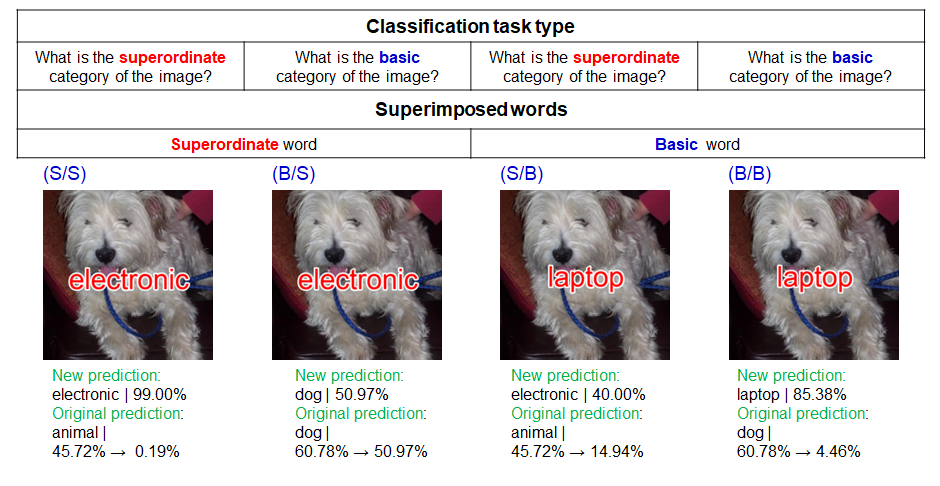

# Language-biased image classification: evaluation based on semantic representations
This repository shares the source codes used in our ICLR 2022 paper, "Language-biased image classification:
evaluation based on semantic representations" by Lemesle*, Y., Sawayama*, M., Valle-Perez, G., Adolphe, M., Sauzéon, H., & Oudeyer, P. Y.
(*equal contribution)


The source codes are to create the word-superimposed images
from the image datasets (Cichy et al., 2016; Mohsenzadeh et al., 2019) 
and to reproduce the analysis results shown in the paper. 
For the word labels, we used the MS-COCO (Lin et al., 2014) 
and CIFAR-100 datasets (Krizhevsky et al., 2009). 
We evaluated the pre-trained CLIP models (Radford et al., 2021) 
by using our benchmark test. Please see more details in our paper. 



## Requirements

The required python libraries to run our codes in your local machine are
summarized in Pipfile, managed by pipenv. 
If you don't have pipenv, you can simply get it with ``pip install pipenv``.
Then, run ``pipenv install`` to install the requirements. 

## Run in a local environment
### download datasets and run tests

To test our benchmark test, you need to just run ``python main.py``.
Then, the code will download the image and label datasets, 
make word-superimposed images, and test a pre-trained CLIP model. 
The evaluation data will be stored in the DATA directory.

### Jupyter notebook Demo 

Once the evaluation data is created, 
you can check the output and make the figures using demo_evaluation.ipynb 
and demo_rsa.ipynb


## Run in Google Colab

ICLR2022.ipynb includes all the codes to run our benchmark test. 
You can also test it on Google Colab without environment settings. 

## Citation information of our paper

```
@inproceedings{lemesle2021evaluating,
  title={Language-biased image classification: evaluation based on semantic representations},
  author={Lemesle, Yoann and Sawayama, Masataka and Valle-Perez, Guillermo and Adolphe, Maxime and Sauz{\'e}on, H{\'e}l{\`e}ne and Oudeyer, Pierre-Yves},
  booktitle={International Conference on Learning Representations (ICLR)},
  year={2022}
}
```

## References of other researches the source code depends on

- Radford, A., Kim, J. W., Hallacy, C., Ramesh, A., Goh, G., Agarwal, S., ... & Sutskever, I. (2021, July). Learning transferable visual models from natural language supervision. In International Conference on Machine Learning (pp. 8748-8763). PMLR.

- Cichy, R. M., Pantazis, D., & Oliva, A. (2016). Similarity-based fusion of MEG and fMRI reveals spatio-temporal dynamics in human cortex during visual object recognition. Cerebral Cortex, 26(8), 3563-3579.

- Mohsenzadeh, Y., Mullin, C., Lahner, B., Cichy, R. M., & Oliva, A. (2019). Reliability and generalizability of similarity-based fusion of meg and fmri data in human ventral and dorsal visual streams. Vision, 3(1), 8.

- Lin, T. Y., Maire, M., Belongie, S., Hays, J., Perona, P., Ramanan, D., ... & Zitnick, C. L. (2014, September). Microsoft coco: Common objects in context. In European conference on computer vision (pp. 740-755). Springer, Cham.

- Krizhevsky, A., & Hinton, G. (2009). Learning multiple layers of features from tiny images.

- Mikolov, T., Chen, K., Corrado, G., & Dean, J. (2013). Efficient estimation of word representations in vector space. arXiv preprint arXiv:1301.3781.
